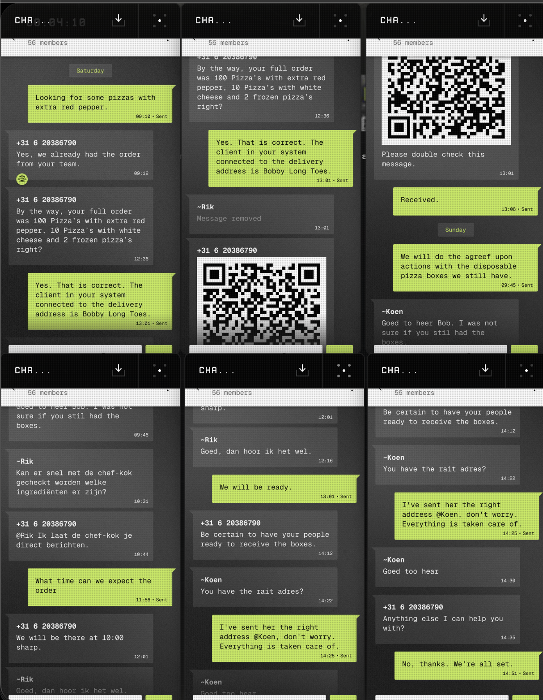

# Episode 2

**Task**

Ik ben op zoek naar een kwetsbaarheid, heb je die gevonden. Stuur die aan mij.


We begin, as many great CTF adventures do, by being assaulted with a lot of messages and absolutely no immediate clue what matters and what is just there to waste our time.

<figure><figcaption></figcaption></figure>

Naturally, the first thing screaming for attention is the QR code. And as responsible security researchers, our first thought is obviously: “Nice, let’s scan this and probably catch some virusses.”

The QR code spits out this gem:

`RGlmZGwgYnN1amRtZiAyMjczODghCgpCbSBwdnMgY3Zzb2ZzdCBic2YgYnUgc2p0bCEgRWZ0dXNweiB1aWYgZWZ3amRmdCE=`&#x20;

That has all the vibes of base64, so into CyberChef it goes:

<figure><figcaption></figcaption></figure>

It decodes to:

```
Difdl bsujdmf 227388!

Bm pvs cvsofst bsf bu sjtl! Eftuspz uif efwjdft!
```

That looks suspiciously like a Caesar cipher had a rough day, so we throw it into a decoder too.

<figure><figcaption></figcaption></figure>

Out comes:

```
check article 227388!

al our burners are at risk! destroy the devices!
```

Close enough. “al” is clearly meant to be “all,” unless the criminal mastermind behind this writes like they’re texting with one hand while fleeing a crime scene.

Now the question is: what article is 227388? My first thought was Tweakers, partly because the challenge was police-themed, and bingo: [https://tweakers.net/nieuws/227388/android-telefoons-bevatten-lek-dat-remotecode-execution-mogelijk-maakt.html](https://tweakers.net/nieuws/227388/android-telefoons-bevatten-lek-dat-remotecode-execution-mogelijk-maakt.html). That article points to the vulnerability: `CVE-2024-40673`.

***

**Task**

Ik ben op zoek naar iets wat ons verder helpt. Een code, een url, iets. Stuur die in de chat zodra je hem hebt.


Next up, we get a GitHub repository: [https://github.com/netherops-dev/shadowlink-recovery-tool](https://github.com/netherops-dev/shadowlink-recovery-tool)

This repo contains a Python script that decrypts a `.shadow` file. Very convenient. Almost _too_ convenient. The repo even includes a sample file, which is adorable, except for one tiny detail: it needs a `.env` file containing `SHADOW_KEY`.

Now normally that would be annoying. But this is CTF land, where operational security goes to die in public commits. Looking through the commit history, we find that someone accidentally committed a `.env` file containing: `SHADOW_KEY=Y3KW0D4H5` . Specifically here: [https://github.com/netherops-dev/shadowlink-recovery-tool/commit/888ab8eb1b9bb17f9487d816d12f0c9f43fd2e67](https://github.com/netherops-dev/shadowlink-recovery-tool/commit/888ab8eb1b9bb17f9487d816d12f0c9f43fd2e67)

Nothing says “secure criminal infrastructure” like leaking your secret key on GitHub. So, naturally, we use it:

```shellscript
shadowlink-recovery-tool on  main [!] via 🐍 v3.10.16
❯ cat .env
SHADOW_KEY=Y3KW0D4H5

shadowlink-recovery-tool on  main [!] via 🐍 v3.10.16
❯ python3 decrypt.py samples/backup_sample.shadow
[00:12:05] Vince: Yo, you got what we need?
[00:12:22] Rico: Yeah. Packed. Moving in 10.
[00:13:01] Vince: Don’t mess this up, man.
[00:13:44] Rico: Chill. It’s locked down. You got the spot?
[00:14:10] Vince: Same as last time. Low-key.
[00:14:36] Rico: Copy. Who’s on lookout?
[00:15:02] Vince: Nobody this time. Just keep it quiet and quick.
[00:16:18] Rico: Traffic’s clear. Pulling out now, won’t be long.
[00:17:05] Vince: Bring the black bag. Nothing extra.
[00:17:29] Vince: Delivery pending, contact on Insta @netherops_logistics
[00:17:45] Rico: Bag’s strapped in. Phone on silent.
[00:18:12] Vince: Pull up on the left I’ll flash once. Don’t stop.
[00:19:03] Rico: See you in 4. Keep eyes on the street.
[00:20:10] Vince: On my way. Don’t move until I’m near.
[00:21:07] Rico: Clean swap. Text if anything goes sideways.
```

At this point, I briefly wondered if the key itself was the answer. It was not. The CTF gods do not reward optimism. So we keep digging.

The decrypted chat mentions an Instagram handle: `@netherops_logistics` That leads us to: [https://www.instagram.com/netherops\_logistics/](https://www.instagram.com/netherops_logistics/). The account shows photos of trucks and, more importantly, the URL on the trucks: `shdwlnk.nl`. Now we’re getting somewhere.

***

**Task**

Ik weet niet precies wat we zoeken, maar als je iets kan vinden wat ons verder helpt zou het geweldig zijn. Een naam, email of andere contactgegevens. Zet het in de chat zodra je het hebt.


Heading over to `shdwlnk.nl`, we are welcomed by a giant 418 page not available screen. A classic. Nothing says “serious infrastructure” like an HTTP joke status code.

So I start poking around in the browser console and logs, because when the frontend is broken, the developers have usually already hidden the next clue in plain sight out of sheer laziness.

<figure><figcaption></figcaption></figure>

And there it is: `/api/v2/phonelog` . A GET request is not allowed. A POST request returns "Invalid request".

Translation: “Yes, this is the right endpoint, but you still have to suffer a little”. Scrolling further through the code reveals the expected payload structure. Very kind of them, honestly. It’s like the web app wanted to help, but HR said it had to at least pretend to have security.

<figure><figcaption></figcaption></figure>

The API wants a phone number. Luckily, one of the phone numbers had already shown up earlier in the chat messages, and for once my memory decided to be useful instead of storing random song lyrics from 2012.

So I submitted that number, and got a response:

<figure><figcaption></figcaption></figure>

The number `+7 (949) 299-61` .

***

**Task**

Kan jij iets van gegevens uit deze call log halen? Heb je iets? Plaats het in de chat.


This leads to an mp3 file containing keypad tones. Excellent. We have officially entered the part of the CTF where you endlessly listen to beeps and convince yourself this is normal.

Using a DTMF decoder, I got: `344408922555333088044288833660777` . Translating that using old-school keypad mapping gives: `di twblf u haven r` .

Clearly something was slightly off, so the next step was to enlist modern AI assistance. Enter Claude, stage left. After some back and forth, Claude suggested this corrected sequence instead: `344408922555333088044288833660777` . That translates to: `di twaalf u haven r` , which was the answer.

And suddenly it starts sounding a lot more Dutch, or at least a lot less like a keyboard fell down the stairs. The original decode was very close, but this version makes much more sense and points us toward the actual intended clue.

